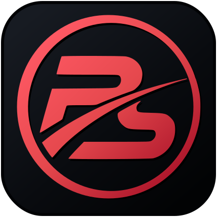
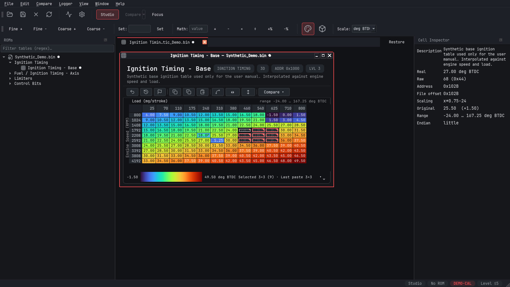

<p align="center">
  
</p>

<h1 align="center">BimmerStein Tuning Suite</h1>

<p align="center"><strong>ECU Calibration and Data Logging</strong></p>

<p align="center">
  A focused Windows workspace for calibration editing, live data, logging, and analysis.
</p>

<p align="center">
  <a href="https://github.com/CAATZ/bimmerstein-tuning-suite/releases/tag/v0.1.0b10"><strong>Download Beta 10</strong></a>
  &nbsp;&middot;&nbsp;
  <a href="output/pdf/BimmerStein-Tuning-Suite-User-Manual.pdf">User Manual</a>
  &nbsp;&middot;&nbsp;
  <a href="https://github.com/CAATZ/bimmerstein-tuning-suite/issues">Issues &amp; Feedback</a>
</p>

<p align="center">
  <code>Windows x64</code>&nbsp;&nbsp;
  <code>BMW MS41 focused</code>&nbsp;&nbsp;
  <code>GPL-2.0-or-later</code>
</p>

---

BimmerStein Tuning Suite edits ECU calibration files, displays live data, records logs, and
performs virtual-dyno analysis. BMW MS41 remains the byte-verified checksum focus, while
definition-proven partial/full editing now extends the editor workflow to additional ECU families.

This is an independent project. It supports RomRaider-compatible definition formats and familiar
calibration workflows, but it is not a Git fork of RomRaider.

<p align="center">
  
</p>

## Beta release

The current public beta is **0.1.0 Beta 10** (`0.1.0b10`):

[Download BimmerStein Tuning Suite 0.1.0 Beta 10](https://github.com/CAATZ/bimmerstein-tuning-suite/releases/tag/v0.1.0b10)

The release provides:

- A PyInstaller Windows installer and portable ZIP.
- A Nuitka Windows installer and portable ZIP (`Windows-x64-Nuitka-*`) as a compiled alternative.
- A corresponding-source ZIP.
- SHA-256 checksums and an exact build-environment inventory for each build backend.

Both portable executables require the DLLs and resources beside them. Extract the complete ZIP
before running one. The two packages contain the same application and resources; the **Nuitka**
suffix identifies only the compiled build backend. The executables are not code-signed, so Windows
may display an unknown-publisher warning.

## Current capabilities

- Open calibration BIN files using user-supplied RomRaider-compatible XML definitions.
- Show separate **Partial BIN** and **Full BIN** sections when duplicate definition framings prove
  how the calibration region maps into a full image.
- Edit scalar values, switches, table values, and table axes.
- Propagate edits across tables that share the same physical axis data.
- Copy, paste, interpolate selections, compare, undo, and create revert points.
- Open curves and maps in the integrated Map Studio to expand padded low-density tables, resample
  onto editable breakpoint grids, repair or smooth values, and review changes before one-step apply.
- Inspect parameter descriptions, storage addresses, scaling, ranges, and related metadata.
- Use deterministic content-sized table windows with compact or normal table density.
- Poll and record DS2 live data through supported serial transports.
- Display live data in tables, graphs, gauges, and dashboards.
- Perform virtual-dyno analysis from recorded data.
- Extend supported transports, protocols, definitions, checksums, and analyses through plugins.
  External-source registration is available for plugin development, with logger-pane polling still
  tracked as deferred work; memory-model selection remains a core-owned safety policy.

## Important safety information

- Always keep an untouched backup of every BIN file.
- Verify saved files before using them with any external flashing software.
- BimmerStein Tuning Suite does **not** flash or write to an ECU. It edits files on disk and reads
  live ECU data.
- Definition XML files are supplied by the user and are not included with the application.
- Native checksum correction is currently limited to verified MS41 framings. Other ECU families
  save requested edits without automatic checksum correction unless an explicit checksum plugin
  or definition binding is configured.
- Flashing, Subaru SSM, generic OBD-II/ELM327, J2534, and Bluetooth transports are not implemented.

DS2 live-data polling has been exercised on hardware. Beta testing is still needed across more ECU
versions, interfaces, Windows configurations, and display-scaling settings. Multi-byte logger
channels should be checked carefully because channel definitions may require explicit endianness.

## Run from source

Use 64-bit Python 3.11 or newer on Windows:

```powershell
py -3.11 -m venv .venv
.\.venv\Scripts\Activate.ps1
python -m pip install --upgrade pip
python -m pip install -e ".[gui,comms]"
python -m ecueditor
```

The optional `d2xx` dependency adds FTDI D2XX transport support:

```powershell
python -m pip install -e ".[gui,comms,d2xx]"
```

The headless command-line entry point is available as:

```powershell
ecueditor-cli --help
```

For Windows executable and installer builds, see [BUILDING.md](BUILDING.md).

## Documentation and support

- [User manual (PDF)](output/pdf/BimmerStein-Tuning-Suite-User-Manual.pdf)
- [User manual (web-readable Markdown)](manual/USER_MANUAL.md)
- [Build and release instructions](BUILDING.md)
- [Beta release notes](RELEASE_NOTES.md)
- [Third-party notices](THIRD_PARTY_NOTICES.md)
- [GNU GPL license](LICENSE)
- [Report a bug or request a feature](https://github.com/CAATZ/bimmerstein-tuning-suite/issues)

Useful bug reports include the ECU/ROM version, Windows version, display-scaling percentage,
application theme, definition-file version, affected table or parameter, exact reproduction steps,
and screenshots when applicable. Do not attach proprietary or personal files unless you intend to
share them.

## License and provenance

BimmerStein Tuning Suite is free software distributed under the GNU General Public License,
version 2 or, at your option, any later version (`GPL-2.0-or-later`). See [LICENSE](LICENSE) for the
complete terms. Copyright (C) 2026 CAATZ and contributors.

Some implementation, especially the virtual-dyno physics formulas, is adapted from RomRaider.
Other parts implement compatible public formats or documented behavior without sharing RomRaider's
Git history. See [THIRD_PARTY_NOTICES.md](THIRD_PARTY_NOTICES.md) for source references, retained
copyright notices, and separately licensed bundled resources.
