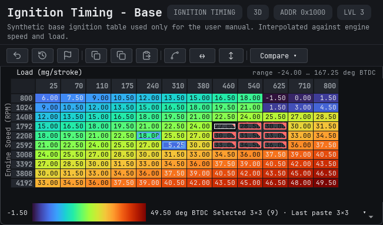
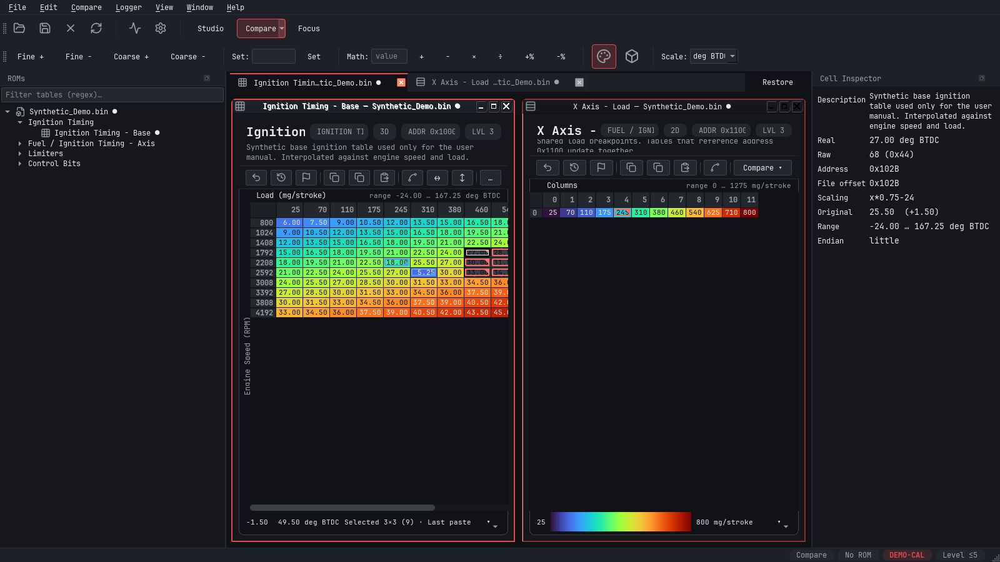
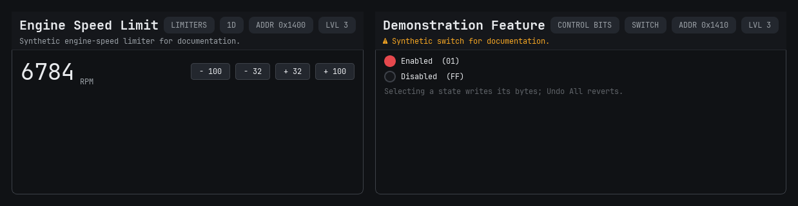
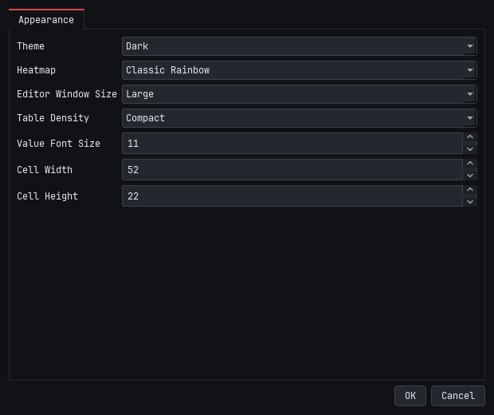
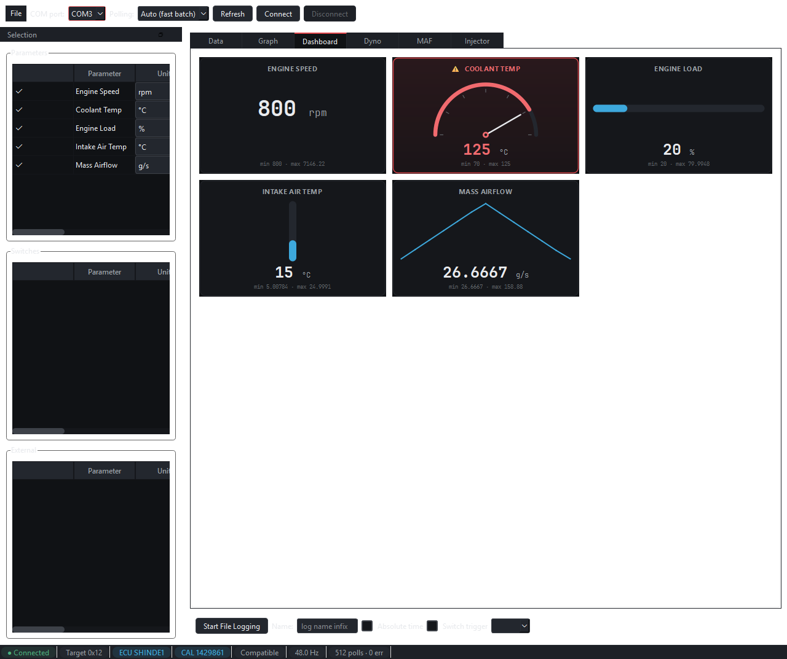

# BimmerStein Tuning Suite User Manual

**ECU Calibration and Data Logging**

Version 0.1.0 Beta 8
Windows x64

BimmerStein Tuning Suite is a desktop calibration editor and live-data logger. The current beta
focuses on BMW MS41 while retaining an extensible definition and plugin architecture for other
platforms.

This manual describes the Beta 8 release. Screenshots use synthetic demonstration data and do not
contain a production ROM or proprietary definition.

<!-- pagebreak -->

## Safety first

Read this section before editing a calibration.

- Keep an untouched backup of every original BIN file.
- Work on a copy and use **Save As** for the first edited version.
- Confirm that the selected definition matches the exact ECU and software version.
- Review changed values, axes, units, scaling, addresses, and checksum status before saving.
- Verify the completed file with an independent method before using external flashing software.
- Make one controlled change at a time and keep notes that identify each saved revision.

> **Important:** BimmerStein Tuning Suite does not flash or write to an ECU. It edits calibration
> files on disk and reads live ECU data. Flashing is a separate operation performed with other
> software and carries its own risk.

Definition and logger XML files are user-supplied and are not bundled with the application. A
wrong or incomplete definition can display or modify the wrong bytes even when the application is
working as designed.

### Beta scope

Beta 8 is intended for testing and feedback. DS2 polling has been exercised on hardware, but more
ECU versions, interfaces, Windows systems, and display-scaling combinations still need validation.
Check multi-byte logger channels carefully because a channel definition may need explicit byte
order information.

Not implemented in Beta 8: ECU flashing, Subaru SSM, generic OBD-II or ELM327, J2534, and Bluetooth
transports.

<!-- pagebreak -->

## Install and start

### Windows installer

1. Download the Beta 8 Nuitka setup executable from the project release page. The PyInstaller setup
   remains available in this transitional beta for comparison.
2. Run the installer and choose the destination folder.
3. Start **BimmerStein Tuning Suite** from the Start menu or desktop shortcut.

The Beta 8 executables are not code-signed. Windows may show an unknown-publisher warning. Confirm
that the filename and SHA-256 checksum match the release before continuing.

### Portable package

1. Download the portable Windows ZIP.
2. Extract the complete archive to a writable folder.
3. Run `BimmerStein-Tuning-Suite.exe` from the extracted folder.

Do not move the executable away from the DLLs and resources beside it. The portable executable is
not a standalone single-file program.

### Main workspace

The main workspace contains the ROM tree at left, the internal table-window canvas in the center,
and the Cell Inspector at right. The top toolbars provide workspace modes, edit operations, color
control, 3D display, and unit selection. The status bar summarizes the active ROM and definition.

<!-- pagebreak -->

## Configure definition files

Definition files tell the editor how names, addresses, storage types, axes, scaling, ranges, and
descriptions map to calibration bytes.

1. Open **File > Definition Manager**.
2. Select **Add** and choose one or more compatible definition XML files.
3. Drag files into priority order. The highest compatible definition is evaluated first.
4. Confirm that each entry parses successfully, then select **Apply** or **OK**.
5. Close and reopen a ROM if it was already open. Definition changes apply to newly opened ROMs.

The application remembers configured paths. If a file is moved or renamed, update its entry in the
Definition Manager.

### When no definition matches

The normal open path matches raw identification bytes from the ROM against the configured
definitions. If nothing matches, the editor can offer a force-load list of available XML IDs.
Force loading is a diagnostic escape hatch, not proof of compatibility. Use it only when you have
independently confirmed the correct definition.

### Partial and full definition sections

Some ECU definition sets publish the same ROM identity in both a partial calibration framing and a
full-image framing. When duplicate definition entries and their concrete table addresses prove one
consistent mapping, a full file opens with separate **Partial BIN** and **Full BIN** sections. The
Partial BIN section contains the normal calibration tables; the Full BIN section contains tables,
parameters, or switches that exist only in the complete image. A standalone partial file keeps the
normal single-section tree.

The editor does not infer this relationship from the ECU name alone. Ambiguous or weakly supported
definition pairs stay in the safe single-section path.

### What to verify after loading

- ROM or calibration ID and file size.
- Definition name or XML ID.
- Table names and categories expected for that software version.
- Plausible axes, values, units, and ranges.
- Addresses and scaling shown by the Cell Inspector.

<!-- pagebreak -->

## Open and navigate a ROM

1. Select **File > Open ROM** or press **Ctrl+O**.
2. Choose a `.bin` or supported `.hex` file.
3. Confirm the ROM identification and definition status in the tree and status bar.
4. Expand the required category, then double-click a table or parameter.

The parameter tree starts collapsed so large definitions remain manageable. Use the filter field to
show only names matching a regular expression. Press **Ctrl+K** to open **Go to Table**, which
searches visible tables across open ROMs.

### Internal windows

Each table, scalar, switch, or 3D view opens as a movable internal window. Opening another table
does not reset the positions of existing windows.

- **Studio** keeps manually arranged windows.
- **Compare** places two chosen windows side by side.
- **Focus** maximizes the active internal window. Press **Esc** to restore the previous workspace.
- **Window > Tile** and **Window > Cascade** arrange all open windows on demand.

Table density and base value font size affect table content, not the outer application window. Each
internal editor window automatically fits its measured table and native window chrome inside the
available workspace.

<!-- pagebreak -->

## Understand a table window

A grid table contains:

1. **Header** - name, category, dimensional type, storage address, and definition description.
2. **Verb bar** - undo, revert, copy, paste, interpolation, and comparison actions.
3. **Axis headers** - calibrated breakpoints for columns and rows.
4. **Value grid** - calibrated cell values colored by the selected heatmap.
5. **Range legend** - the displayed minimum, maximum, and units.

The Cell Inspector follows the current cell and can show its real value, raw bytes, storage address,
file offset, scaling expression, original value, range, and byte order. Table and parameter headers
also surface definition descriptions and addresses when available.

Color is a navigation aid, not a validity check. Always evaluate numbers and units directly.

<!-- pagebreak -->

## Edit calibration tables

### Direct entry

1. Double-click a cell, or select it and begin typing.
2. Enter the required calibrated value.
3. Press **Enter** to commit or **Esc** to cancel.

The editor converts the real value to the table's storage representation, then displays the value
that can actually be encoded. Values outside the defined range are rejected or constrained by the
table definition.

### Select and adjust regions

- Click one cell to make it current.
- Drag across cells or use standard Ctrl/Shift selection to select a region.
- Use **Fine +**, **Fine -**, **Coarse +**, or **Coarse -** for definition-sized steps.
- Enter a number beside **Set** and apply it to the selection.
- Choose a math operation to add, subtract, multiply, divide, or apply a percentage.
- Select **Interpolate** (Shift+I). A selected row uses horizontal linear interpolation, a selected
  column uses vertical linear interpolation, and a rectangular selection uses bilinear
  interpolation. The selection must be one contiguous line or rectangle.

### Expand and resample in Map Studio

Choose **Map Studio** (Ctrl+Shift+M) from a curve or map window for changes that need more review
than the quick interpolation command. The table that opens Map Studio is already the destination;
there is no second destination selection step.

Map Studio works on a local snapshot until **Apply to _table name_** is chosen. It provides:

- **Linear** and shape-preserving **PCHIP** interpolation for curves.
- **Bilinear** and shape-preserving **PCHIP** interpolation for two-axis maps.
- **Hold edge values** and **Do not extrapolate** boundary safeguards.
- **Linear to destination**, which continues the final source slope across the complete destination
  grid, and **Limited linear**, which caps that continuation by a configurable number of edge intervals.
- Anomaly detection, selected-cell harmonic repair, whole-table smoothing with a mandatory preview, local undo/redo, difference views, slices, 3D review, and a safety summary.
- Whole-table actions such as **Find anomalies**, **Smooth table**, and **Copy Entire Table** are
  available without selecting a cell. Selection-only repair and copy commands remain disabled until
  a region is selected. Accepting the smoothing preview closes it and installs the reviewed values
  into the local Studio source or result.
- The suite's selected heatmap palette (Classic Rainbow by default) and the same Normal/Compact
  numeric sizing used by the main tables. Studio tables open at 100%; **Fit** is an explicit command
  when the complete grid should be scaled into the current viewport. Amber outlines identify
  extrapolated result cells; Changes uses a symmetric blue-to-red scale centered on zero.
- Horizontal and vertical Studio axis labels use the same scaled numeric font as the table cells,
  including Compact density and explicit zoom or Fit changes.

For a physically expanded table whose final rows or columns repeat a smaller calibration, use
**Detect** or select the unique 2 × 2-or-larger source rectangle and choose **Use Region**. Then
choose **Expand to _columns_ × _rows_**. Map Studio keeps the ROM table's existing physical dimensions,
creates evenly spaced destination axes by default, and interpolates the selected source across all
available cells. Switch to custom axes when specific breakpoints are required. Storage-backed axes
must remain strictly monotonic after their real values are encoded; static axes cannot be expanded.

Increasing a destination axis beyond the selected source range requires **Linear to destination**
or **Limited linear**. Adding more breakpoints within the original range is interpolation, not
extrapolation. Changing the source region, destination grid, interpolation method, boundary policy,
or edge limit invalidates the current preview so stale results cannot be applied accidentally.

Review the Result, Changes, visualizations, extrapolated-cell highlights, and safety summary before
applying. Apply quantizes the axes and values first, then commits both atomically as one table undo
operation. If the opening table changes while Map Studio is open, apply is disabled until the source
is reloaded. Numerical tools cannot determine whether a calibration is safe for an engine.

### Visual edit indicators

- A completed selection uses a neutral gray overlay.
- The region being dragged uses a blue overlay.
- The current cell has a high-contrast double outline.
- A changed value has a red border and corner marker when it increased.
- A changed value has a blue border and corner marker when it decreased.
- A recent paste has an amber dashed perimeter and a size summary.

These indicators compare the current data with the active revert baseline. They do not alter the
heatmap values.

### Copy and paste

**Copy Sel** copies the selected rectangle as tab-separated values. **Copy Table** copies the full
grid. Paste begins at the current cell and supports rectangular data copied from compatible editors
or spreadsheets. Confirm dimensions, axis orientation, units, and rounding after every paste.

<!-- pagebreak -->

## Edit shared table axes

Storage-backed axis headers are editable. Double-click a column or row header, enter the calibrated
breakpoint, and press **Enter**.

To keep dense maps readable, numeric headers show the coarsest rounded label that still
distinguishes every different breakpoint. Hover a header to see its exact engineering value;
double-clicking also opens that exact value for editing. Rounding is display-only and never changes
the stored axis or its scaling.

Some definitions expose the same breakpoint data as a separate axis table. If multiple open tables
refer to the same shared physical axis bytes, an edit is synchronized across all of those views.
This prevents one window from displaying stale breakpoints after another window changes them.

Before editing an axis:

- Confirm the axis name, units, address, size, storage type, and scaling.
- Identify every table that shares the physical data.
- Preserve the ordering required by the calibration strategy.
- Recheck every affected table after the change.

A static or label-only axis is descriptive and cannot be edited. The editor only commits axis
changes when the definition maps that axis to writable storage.

<!-- pagebreak -->

## Work with scalars and switches

### Scalar parameters

Scalar windows present one large calibrated value, its units, and four step buttons. Double-click
the value to enter a number directly, or use the fine and coarse decrement/increment buttons. The
definition controls storage, scaling, formatting, and step size.

### Switch parameters

Switch windows list the named states and the raw byte pattern for each state. Selecting a state
writes its defined bytes to the open ROM image. **Undo All** returns the parameter to its revert
baseline.

Bitwise switches expose independent named flags when the definition maps several options into one
stored value.

### Addresses and descriptions

The title/header and Cell Inspector expose available definition metadata for tables, scalars,
switches, and axes. For switches, review the storage address plus the byte pattern shown beside each
state. Descriptions come from the loaded definition and may be absent when the source XML does not
provide one.

<!-- pagebreak -->

## Compare, undo, and save

### Undo

- **Undo** or **Ctrl+Z** reverses the most recent edit in the active table.
- **Redo** or **Ctrl+Y** reapplies the most recently undone table edit.
- **Undo All** or **Ctrl+Shift+Z** restores the active table to its current revert baseline.

### Set Revert Point

**Set Revert Point** accepts the current table values as a new local baseline. After setting it,
change borders clear and **Undo All** returns to that new point instead of the values first loaded
from disk. This is useful for comparing a new experiment with an already accepted set of edits.

Setting a revert point does not save the ROM file. It also does not erase the original file on disk.

### Compare

Use the table **Compare** menu to show changes or compare the active table against a compatible
table. **Compare > Compare Images** compares open ROM images. Use **Window > Compare Active With**
to choose two open views for the side-by-side workspace.

Comparison colors use a symmetric difference scale: neutral cells sit at the center, while stronger
blue or red saturation indicates a larger negative or positive difference. The legend always shows
matching negative and positive limits; Percent mode expresses those limits as percentages.

### Save safely

1. Review all changed tables and shared axes.
2. Select **File > Save As** or press **Ctrl+Shift+S** for a new revision.
3. Choose a descriptive filename that preserves the original.
4. Review checksum and status information.
5. Reopen and independently verify the saved file before any separate flashing operation.

**Save** writes to the current file path. The editor warns about unsaved ROM changes when closing.

Automatic checksum correction is currently native only for verified MS41 partial and full
framings. A non-MS41 BIN is saved without automatic checksum correction unless its definition or an
installed plugin explicitly selects a compatible checksum manager. Verify those files with a
family-specific external tool before flashing them elsewhere.

**Reload ROM from Disk** or **F5** rereads the selected ROM's current source file. Unsaved ROM
edits require confirmation because reload discards them and clears table undo history. Open tables
and 3D views remain connected to the reloaded ROM. A clean Map Studio adopts the new source; a Map
Studio with local Source edits or a generated Result preserves that work, marks it stale when the
opening table changed, and disables Apply until its source is reloaded. Combined full-BIN views
validate reload through the native Full BIN identity and then resynchronize both sections. A file
with a different size, ROM identity, or memory framing is rejected and must be opened separately.

<!-- pagebreak -->

## Appearance and table sizing

Open **Edit > Settings** to change:

- Theme: Dark, Light, or System.
- Heatmap: Rainbow or Viridis.
- Table density: Normal or Compact.
- Base numeric value font size.

The editor calculates natural column widths from the actual formatted values and styled axis labels,
then fits the internal window to that content. Small tables remain compact instead of inheriting
unused space from large maps. Very large tables use scrollbars when the complete natural size cannot
fit in the current workspace.

If text is cropped, first try Normal density or a smaller value font. Also confirm the Windows
display-scaling percentage and restart the application after a major monitor or scaling change.

<!-- pagebreak -->

## Configure and use the logger

The logger reads live values through a supported communication transport. It does not change ECU
calibration memory.

### Before connecting

1. Connect a supported serial interface and install its driver.
2. Open the Logger with **Logger > Launch Logger** or **Ctrl+L**.
3. Load or configure the required user-supplied logger definition.
4. Select the COM port and refresh the list if necessary.
5. Choose a polling mode.

**Auto (fast batch)** uses the fastest eligible DS2 batch/grouped reads. **Compatible** uses
individual memory reads and is the safer fallback when a definition or ECU does not behave
correctly in batch mode.

### Select channels

The Selection dock separates Parameters, Switches, and External channels. Each row can be enabled
for polling and independently routed to Data, Graph, or Dashboard.

Start with a small channel set. Adding channels increases the amount of work in each polling cycle
and can reduce update rate. Confirm units, plausible values, and stable error counts before adding
more.

Select **Connect**. The status bar reports connection state, target module, ECU ID, calibration ID,
polling mode, rate, polls, errors, and recording state.

<!-- pagebreak -->

## Logger views and recording

### Data

The Data tab provides a compact numerical view of selected live channels. Use it for validation and
when maximum information density matters.

### Graph

The Graph tab plots recent channel history. Keep scale differences in mind when interpreting
several signals together.

### Dashboard

The Dashboard tab presents configured digital, needle, bar, and sparkline gauges. Warning
thresholds and gauge styles are presentation aids and must be configured for the channel units.

### Dyno and analysis

The Dyno tab can capture and analyze a suitable acceleration run using configured vehicle data.
Analysis tabs may provide additional workflows when their required channels are selected. Results
depend on the accuracy of the logger data, vehicle profile, environmental inputs, and test method;
they are estimates rather than chassis-dyno measurements.

### CSV recording

1. Use **File > Set Log Directory** to choose the output folder.
2. Optionally enter a short log-name suffix.
3. Select **Start File Logging**, or press **F1**.
4. Perform the test while monitoring connection and error status.
5. Stop logging before disconnecting.

Switch-triggered logging can arm recording around a defined switch transition. Confirm the selected
switch and trigger behavior in a safe stationary test before relying on it.

Logger profiles save channel/view selections, port, and log directory for reuse. They do not embed
the ECU definition itself.

<!-- pagebreak -->

## Keyboard shortcuts

| Area | Shortcut | Action |
| --- | --- | --- |
| Application | Ctrl+O | Open ROM |
| Application | Ctrl+S | Save |
| Application | Ctrl+Shift+S | Save As |
| Application | Ctrl+W | Close ROM |
| Application | F5 | Reload selected ROM from disk |
| Application | Ctrl+L | Launch Logger |
| Application | Ctrl+K | Go to Table |
| Workspace | Ctrl+Alt+1 | Studio mode |
| Workspace | Ctrl+Alt+2 | Compare mode |
| Workspace | Ctrl+Alt+3 | Focus mode |
| Workspace | Ctrl+F4 | Close active internal window |
| Workspace | Ctrl+Tab | Next internal window |
| Workspace | Ctrl+Shift+Tab | Previous internal window |
| Table | Ctrl+Z | Undo last table edit |
| Table | Ctrl+Y | Redo last table edit |
| Table | Ctrl+Shift+Z | Undo all to revert point |
| Table | Ctrl+C | Copy selection |
| Table | Ctrl+Shift+C | Copy table |
| Table | Ctrl+V | Paste |
| Table | Shift+I | Interpolate selection |
| Table | Ctrl+Shift+M | Open Map Studio |
| Table | + / _ | Coarse increment / decrement |
| Table | * | Multiply selection |
| Logger | F1 | Start or stop file logging |
| Logger | F9 | Unselect all channels |
| Logger | F11 | Toggle Selection dock |
| Logger | F12 | Cycle gauge style |

Shortcuts for table editing apply when the active grid or one of its child controls has focus.

<!-- pagebreak -->

## Troubleshooting

### The ROM has no matching definition

- Confirm that definition paths are present and parse successfully.
- Confirm the ROM file size and identification bytes.
- Use a definition for the exact software version.
- Do not force load an approximate definition merely because its table list looks familiar.

### Values or axes look implausible

- Stop editing and compare with the untouched backup.
- Verify storage address, storage type, byte order, scaling, and units in the inspector.
- Confirm that the correct inherited definition resolved.
- Reopen the file after correcting the definition.

### A table does not fit or text is cropped

- Try Compact density or a smaller base value font.
- For clipped labels, try Normal density so row height follows the font.
- Check Windows display scaling and available workspace size.
- Use Focus mode for very large tables.

### Logger will not connect

- Confirm the correct COM port and interface driver.
- Close other software that may own the port.
- Verify ECU power and the communication wiring.
- Try Compatible polling mode.
- Confirm that the logger definition targets the correct ECU module and address class.

### Live values are wrong but polling is stable

- Verify channel address, byte length, storage type, byte order, expression, and units.
- Do not assume the global byte-order default is correct for a multi-byte channel.
- Compare against a trusted capture or known operating condition.

### The application closes with unsaved changes

Use the close prompt carefully. Choose to keep working if you have not saved or intentionally
discarded all changes. Revert points are in-memory edit baselines and are not substitutes for saved
files.

<!-- pagebreak -->

## Pre-save checklist

- [ ] The original BIN remains untouched and separately backed up.
- [ ] The definition exactly matches the ECU/software version.
- [ ] Every changed value and shared axis was reviewed in calibrated units.
- [ ] Unexpected changed-cell indicators were investigated.
- [ ] The output uses a new, descriptive filename.
- [ ] Checksum and status information were reviewed.
- [ ] The saved file was reopened and independently verified.
- [ ] Any later flashing process has its own recovery plan and verified power supply.

## Support and project information

- Project: [github.com/CAATZ/bimmerstein-tuning-suite](https://github.com/CAATZ/bimmerstein-tuning-suite)
- Issues: [Report a bug or request a feature](https://github.com/CAATZ/bimmerstein-tuning-suite/issues)
- Release notes: [Beta 8 release notes](../RELEASE_NOTES.md)
- Licensing: [GNU GPL and third-party notices](../THIRD_PARTY_NOTICES.md)

Useful bug reports include the ECU or ROM version, Windows version, display-scaling percentage,
application theme, definition version, affected table or parameter, exact reproduction steps, and
screenshots. Do not attach proprietary or personal files unless you intend to share them.

BimmerStein Tuning Suite is independent software. It supports compatible public formats and
workflows but is not a Git fork of RomRaider. See the third-party notices for retained credits,
source references, and licenses.

Copyright (C) 2026 CAATZ and contributors. Licensed under GPL-2.0-or-later.
